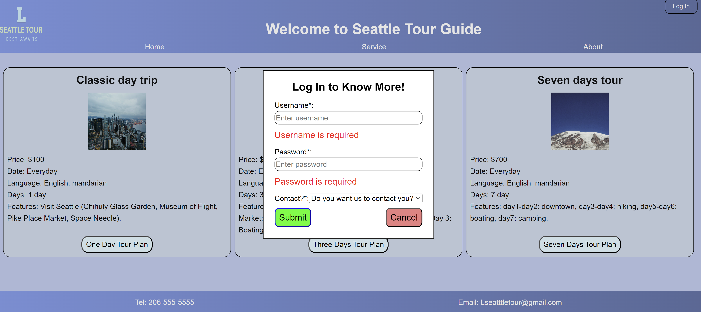
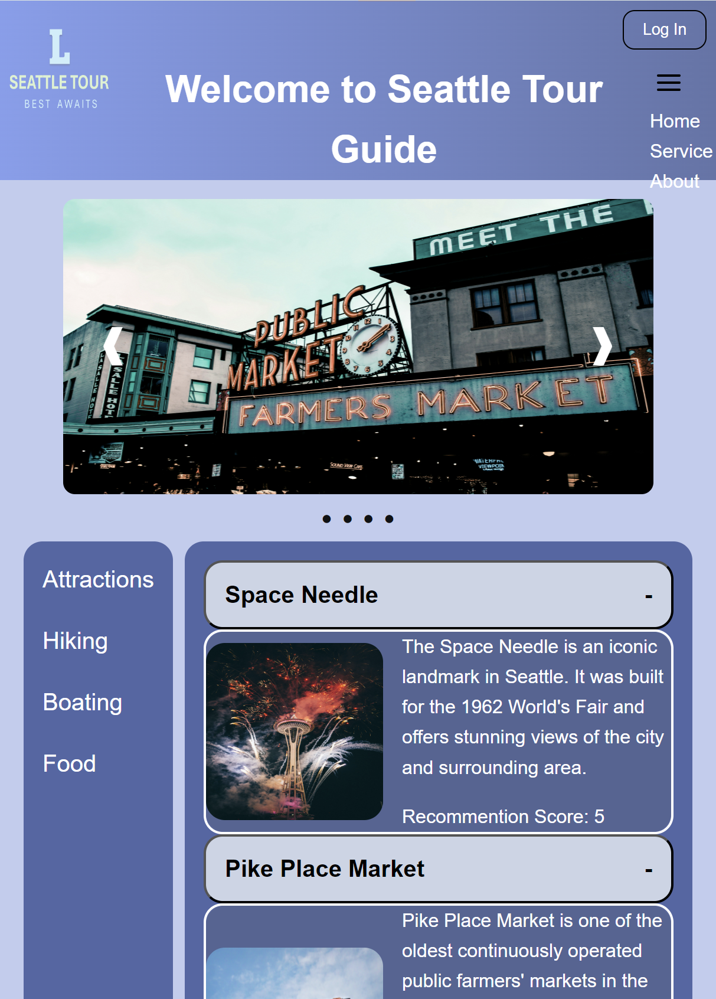
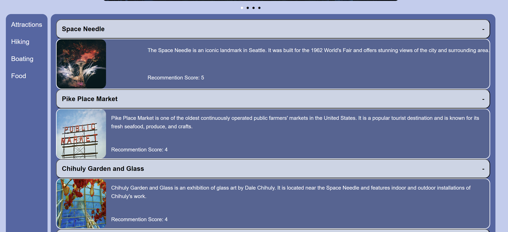
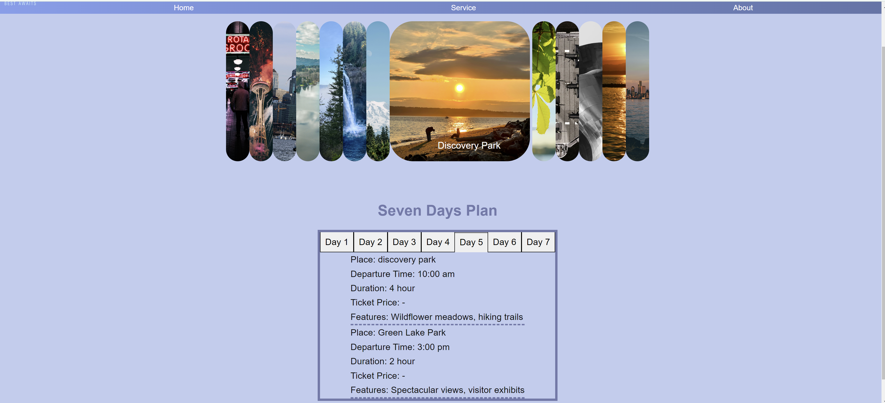
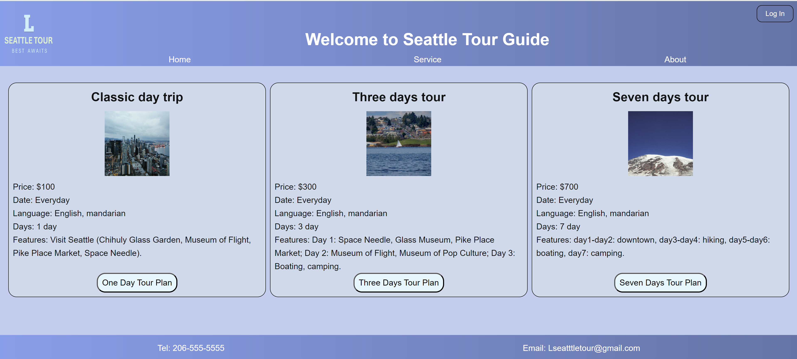

# Seattle-Tour-Guide

## Introduction
This project is a single-page application (SPA) built with HTML, CSS, JavaScript, and React. It showcases various features without using any additional libraries beyond what Vite provides.   
[Visit the deployed app on Render](https://seattle-tour-guide.onrender.com)

## Features  
**Modal Form for Login:** A pop-up dialog that allows users to log in without leaving the current page.  

**Skiplink:** A feature that helps users navigate directly to the main content, improving accessibility.  

**Adaptive Hamburger Menu and Dropdown Navigation Menu:** A responsive menu that turns into a hamburger icon on smaller screens. Dropdown Navigation Menu: A navigation menu that expands to show more options when clicked. 

**Accordion:** A component that allows users to show or hide content by clicking on headings.  

**Tabs:** A feature that enables users to switch between different sections of content easily.  

**Cards:** Visual panels that display related information together, making it easier to read.  

**Carousel:** A rotating display of images, showcasing multiple items one at a time.  

**Gallery:** A collection of images that can be filtered or sorted based on user preferences.  


## Project starts
1. Install Dependencies:  
```npm install```  
  
2. If you need to build the Project:  
```npm run build```  
  
3. Start the server:  
```npm run dev```  

